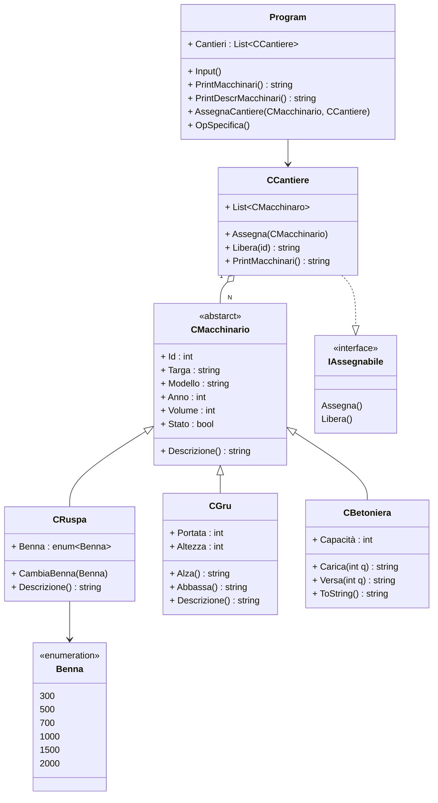

```mermaid
classDiagram

    %% CLASSI PRINCIPALI
    
    class Program{
        + Cantieri : List~CCantiere~

        + Input()
        + PrintMacchinari() string
        + PrintDescrMacchinari() string
        + AssegnaCantiere(CMacchinario, CCantiere)
        + OpSpecifica()
    }

    class CCantiere{
        + List~CMacchinaro~

        + Assegna(CMacchinario)
        + Libera(id) string
        + PrintMacchinari() string
    }

    class CMacchinario{
        <<abstarct>>
        + Id : int
        + Targa : string
        + Modello : string
        + Anno : int
        + Volume : int
        + Stato : bool 
        %%disponibile o assegnato

        + Descrizione() string

    }

    class CRuspa {
        + Benna : enum~Benna~
        
        + CambiaBenna(Benna) 
        + Descrizione() string
    }

    class Benna{
        <<enumeration>>
        300
        500
        700
        1000
        1500
        2000
    }

    class CGru {
        + Portata : int
        + Altezza : int

        + Alza()string
        + Abbassa()string
        + Descrizione() string
    }

    class CBetoniera {
        + Capacità : int
        
        + Carica(int q) string
        + Versa(int q) string
        + ToString() string
    }

    class IAssegnabile{
        <<interface>>
        Assegna()
        Libera()
    }

    

    %% INTERFACCIA
    CCantiere ..|> IAssegnabile

    %%ENUMERAZIONI
    CRuspa --> Benna

    %%ASSOCIAZIONE
    CCantiere "1" o-- "N" CMacchinario

    %% CLASSE ASTRATTA
    CMacchinario <|-- CRuspa
    CMacchinario <|-- CGru
    CMacchinario <|-- CBetoniera

    %% Program usa le classi ma non le possiede
    Program --> CCantiere
```
