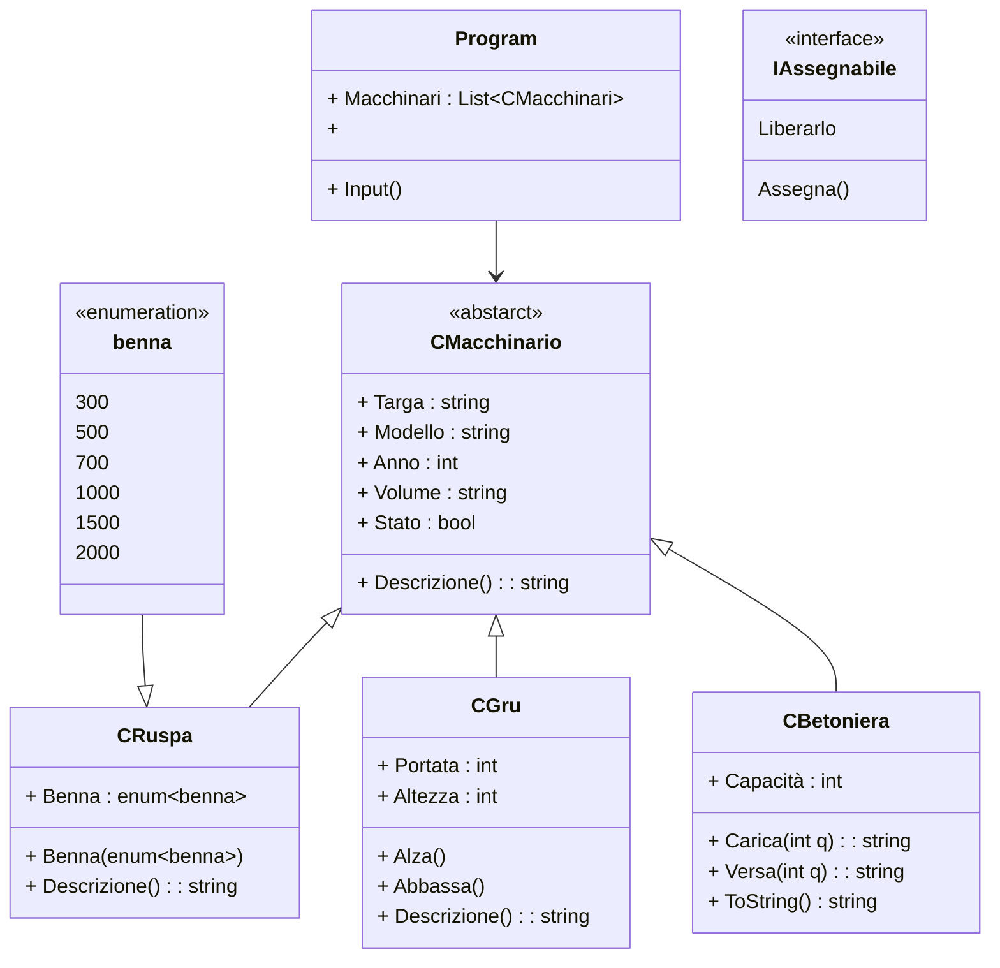

```mermaid
classDiagram

    %% CLASSI PRINCIPALI
    
    class Program{
        + Macchinari : List~CMacchinari~

        + Input()
        + 

    }

    class CMacchinario{
        <<abstarct>>
        + Targa : string
        + Modello : string
        + Anno : int
        + Volume : string
        + Stato : bool

        + Descrizione() : string

    }

    class CRuspa {
        + Benna : enum~benna~
        
        + Benna(enum~benna~)
        + Descrizione() : string
    }

    class benna{
        <<enumeration>>
        300
        500
        700
        1000
        1500
        2000
    }

    class CGru {
        + Portata : int
        + Altezza : int

        + Alza()
        + Abbassa()
        + Descrizione() : string
    }

    class CBetoniera {
        + Capacità : int
        
        + Carica(int q) : string
        + Versa(int q) : string
        + ToString() string
    }

    class IAssegnabile{
        <<interface>>
        Assegna()
        Liberarlo
    }

    

    %% RELAZIONI

    %%ENUMERAZIONI
    benna --|> CRuspa

    %% EREDITARIETÀ
    CMacchinario <|-- CRuspa
    CMacchinario <|-- CGru
    CMacchinario <|-- CBetoniera

    %% Program usa le classi ma non le possiede
    Program --> CMacchinario
```
