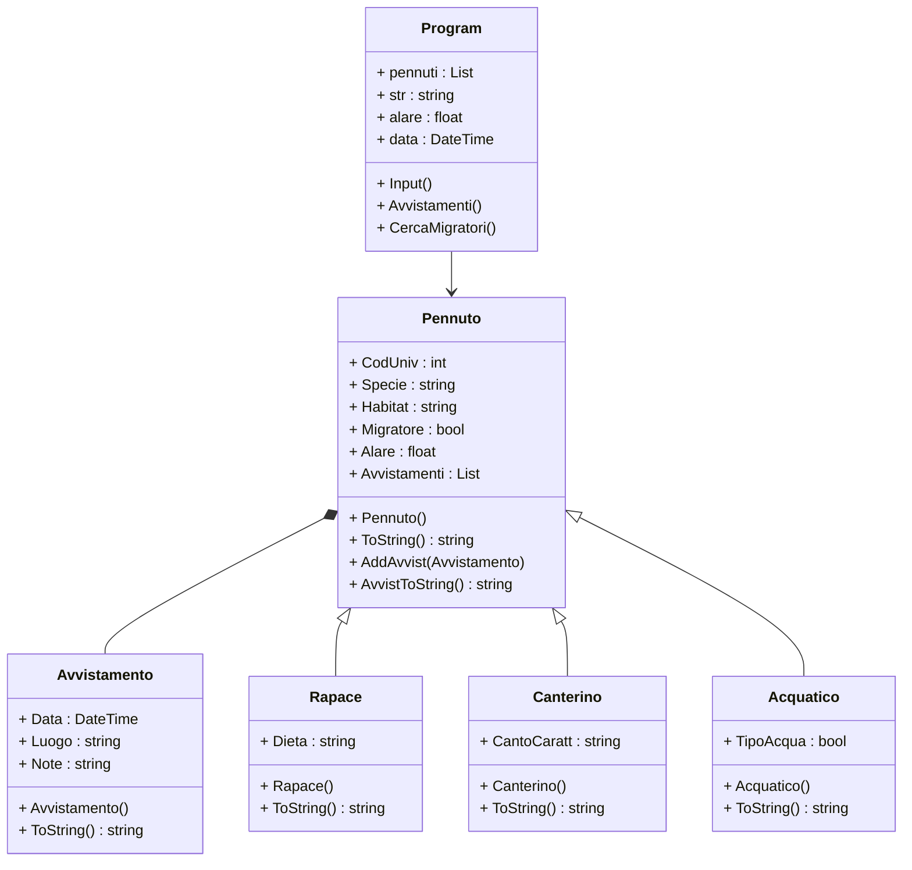

```mermaid
classDiagram

    %% CLASSI PRINCIPALI
    
    class Program{
        + pennuti : List<cPennuto>
        + str : string
        + alare : float
        + data : DateTime

        + Input()
        + Avvistamenti()
        + CercaMigratori() 

    }

    class Pennuto {
        + CodUniv : int
        + Specie : string
        + Habitat : string
        + Migratore : bool
        + Alare : float
        + Avvistamenti : List<Avvistamento>
        
        + Pennuto()
        + ToString() string
        + AddAvvist(Avvistamento)
        + AvvistToString() string
    }

    class Avvistamento {
        + Data : DateTime
        + Luogo : string
        + Note : string

        + Avvistamento()
        + ToString() string
    }

    class Rapace {
        + Dieta : string
        
        + Rapace()
        + ToString() string
    }

    class Canterino {
        + CantoCaratt : string
        
        + Canterino()
        + ToString() string
    }

    class Acquatico {
        + TipoAcqua : bool
        
        + Acquatico()
        + ToString() string
    }

    %% RELAZIONI

    %% COMPOSIZIONE: il pennuto crea e gestisce gli avvistamenti
    Pennuto *-- Avvistamento

    %% EREDITARIETÀ
    Pennuto <|-- Rapace
    Pennuto <|-- Canterino
    Pennuto <|-- Acquatico

    %% Program usa le classi ma non le possiede
    Program --> Pennuto
```
